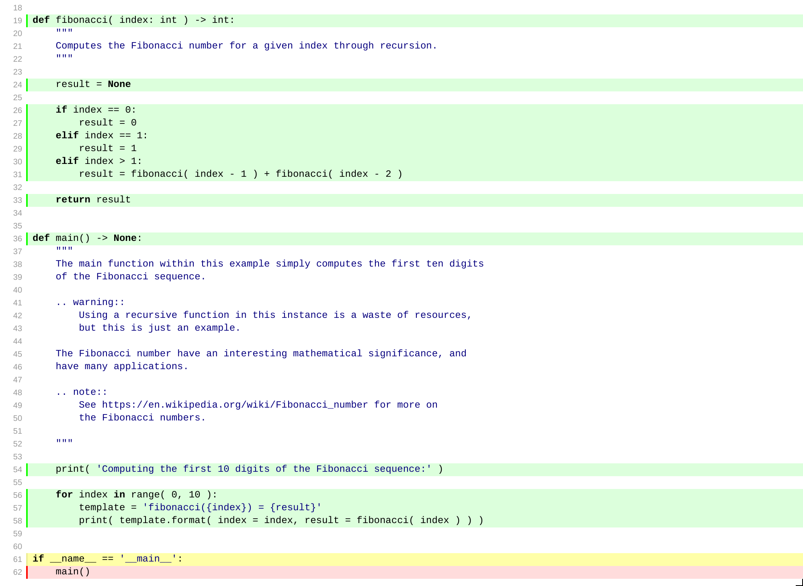
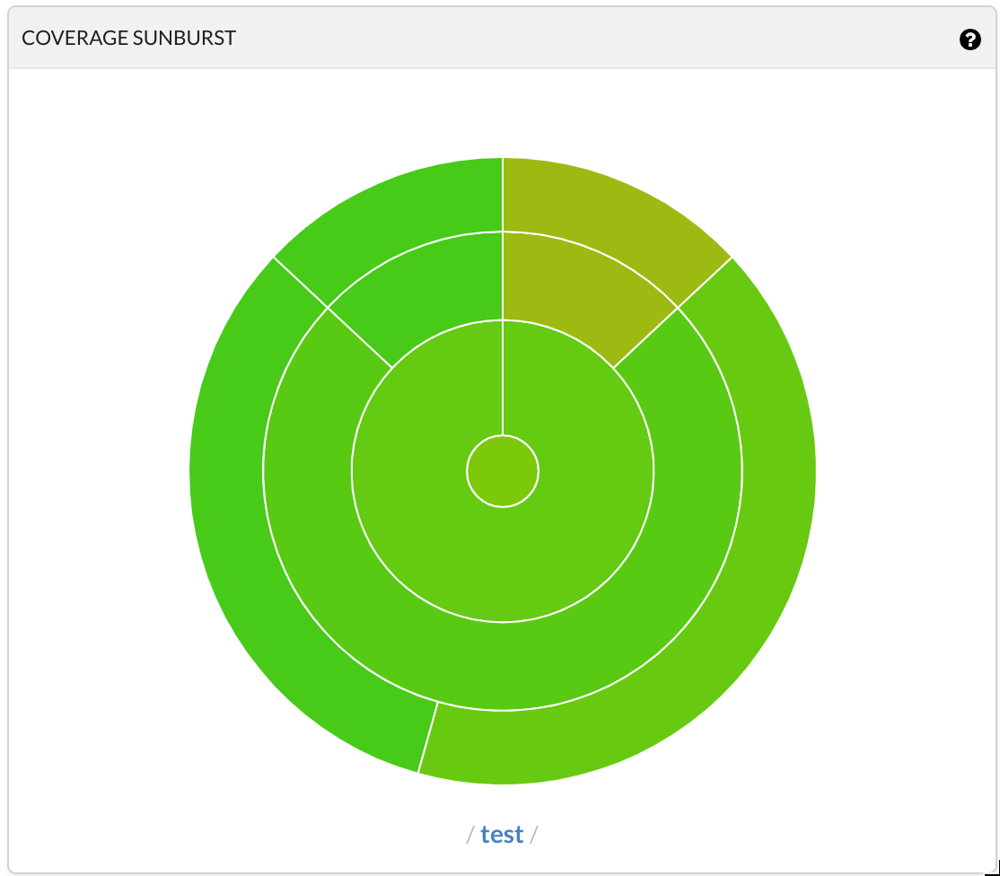
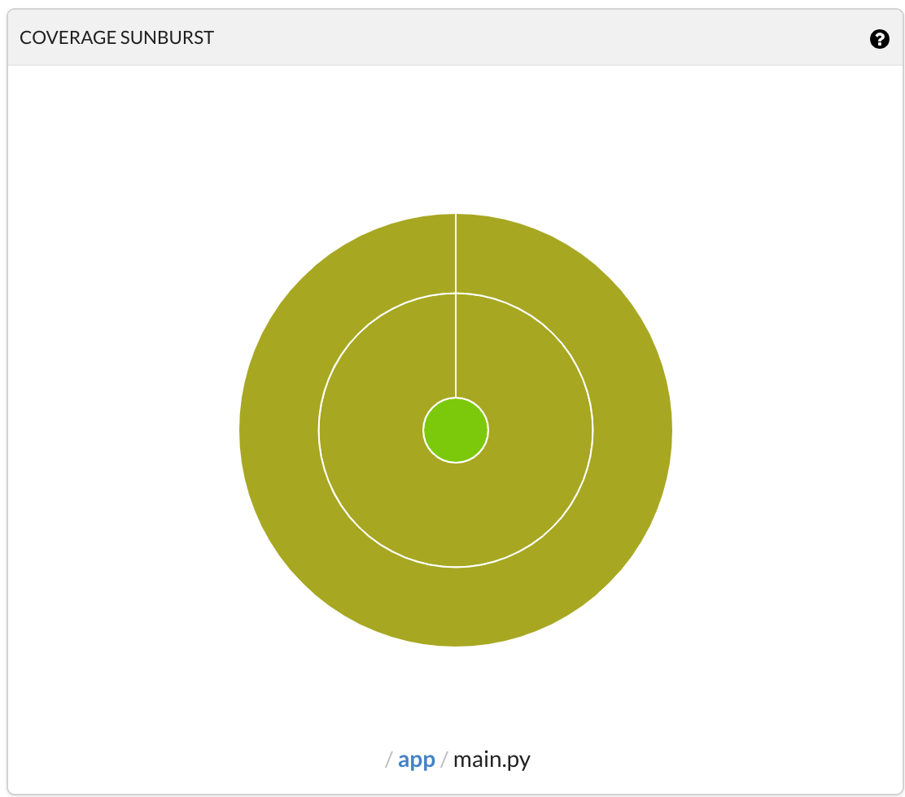
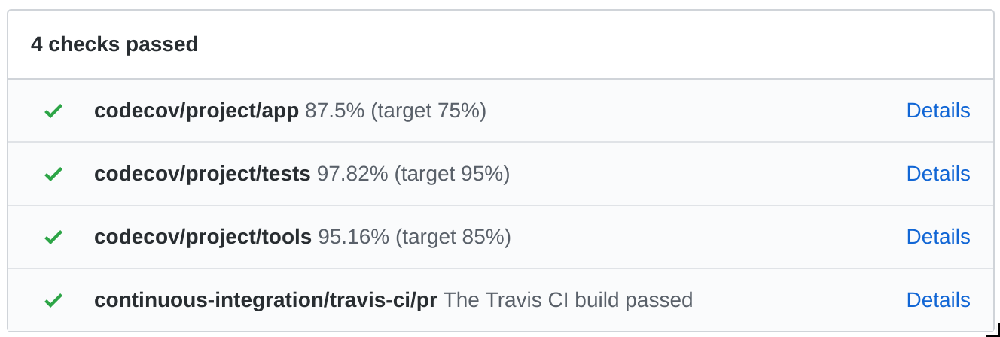

.. _section-coverage-in-general:

Code Coverage based on Unit Tests
=================================

This template relies on the use of the `coverage` module in conjunction with the
`unittest`/`pytest` modules to automatically compile code coverage reports.

Underlined here is the importance of writing tests which not only maximize
coverage, but also prevent breaking applications later during refactoring and
maintenance stages of a project's lifecycle.

.. warning::

    Code coverage alone is not a good indicator of project health. But it's
    a start.

Coverage Makefile Targets
-------------------------

The makefile offer the `test` and the `coverage` targets. The former collects
and run unit tests while gathering coverage statistics. The second target calls
`test` then generates an html report, located under `reports/coverage/` (as well
as printing out stats in the console).

.. note::

    For more info on code coverage in python, see
    https://coverage.readthedocs.io/en/latest/#quick-start

For computing the current coverage of your working
directory, simply run:

.. code-block:: shell

    make coverage # depends on clean and test targets

Which will runt all the tests, and will output the coverage file by file:

.. code-block:: shell

    Name                                     Stmts   Miss Branch BrPart  Cover   Missing
    ------------------------------------------------------------------------------------
    app/main.py                                 16      1     10      1    92%   62, 61->62
    test/test_app/test_main.py                  12      0      0      0   100%
    test/test_methodology/test_examples.py      12      1      0      0    92%   49
    test/test_tools/test_path_explorer.py       30      0      4      0   100%
    test/test_tools/test_pretty_console.py      38      1      2      0    98%   86
    tools/path_explorer.py                      27      0     18      0   100%
    tools/pretty_console.py                     35      2      8      1    93%   15, 100, 99->100
    ------------------------------------------------------------------------------------
    TOTAL                                      170      5     42      2    97%

Additionally, the coverage routine also generates an HTML report (see
`reports/coverage/index.html`) which has the added benefit of highlighting
the code statements executed and skipped.

    Coverage report highlighting

.. note::

    Code coverage can be easily integrated with travis and codecov using
    the `codecov` module.

Uploading to Codecov.io
-----------------------

Computing code coverage locally is a nice tool, but most importantly, the
ability to follow the evolution of your coverage throughout the development
cycles of your application is a very effective metric to know how your
process is evolving, and whether or not your investment on testing in
increasing or decreasing.

This is achieved through a configuration file `.codecov.yml` located at the
root of the project directory:

.. literalinclude:: ../../../.codecov.yml
    :caption: .codecov.yml
    :language: yaml
    :emphasize-lines: 7,10,13

And a few special directives to the `.travis.yml`:

.. literalinclude:: ../../../.travis.yml
    :caption: .travis.yml
    :language: yaml
    :emphasize-lines: 13,19-20

Therefore, the continuous integration build is also setup to upload code
coverage statistics to Codecov.io automatically if the build was successful. It
has the added benefit of offering much better visualization of your coverage.

.. figure:: ../assets/coverage/coverage_pie_example.png
    :alt: Example 1 of code coverage pie displayed at codecov.io
    :align: center
    :width: 50%

    Coverage 'Pie' for the complete project.

    Coverage 'Pie' for the test/ folder.

    Coverage 'Pie' for the app folder.

.. note::

    More on Codecov's graphs at https://docs.codecov.io/docs/graphs#section-sunburst

Codecoverage as a Check in GitHub
---------------------------------

One of the main advantages to this approach is that you can extrapolate
'quality gates' directly from the coverage targets, which will define whether
of not your CI status is a pass or a fail, for example while preparing a new
pull request (if you have linked Travis and Codecov to your github project).

    Recorded checks status after a merged PR.

Discussion on Coverage Targets
------------------------------

There is no right or wrong approach to code coverage. Generally speaking, the
obvious rule is **more is better** but you should be weary of not confusing code
coverage for functional testing. It is but a metric informing you about how much
of the code was executed once, but does not necessarily prove the stability,
robustness or overall quality of an application or module.

So let's discuss coverage targets with that in mind. What is a coverage target?
Well, it's a local or global coverage limit you deem acceptable for a
project or portions of it. It implies that a lower score than the expected
target should constitute a fail in regards to continuous integration.

Let's dive in this projects's default targets by looking at the Codecov
configuration file we looked at earlier:

.. code-block:: yaml

    project:
        # [...]
        app:
            paths: "app/"
            target: 75%
        tests:
            paths: "test/"
            target: 95%
        tools:
            paths: "tools/"
            target: 85%

In essence, this configuration defines different targets for different
sub-folders. Behind these numbers lie a few important concepts:

The app
*******

It's likely a **waste of time to try and cover 100%** of your app - think
return on investment - but considering good development practices, and a
drive for quality anything below 60% might be considered dangerous on the long
game.Now, of course, it will depend on so much more than than: the application
life cycle, the expected reuse of modules, shared dependencies, time
constrains, etc...

All critical components of your app should be tested, but some tests might be
too complicated to automate. I find between 50% and 80% to be a sweet spot for
trusting your continuous integration will catch a few bullets for you.

The tests
*********

The **testing code itself should always be close to 100%** coverage except if
you're expecting to skip some tests (this is the case in this project). Hence
it's good practice to separate that coverage from your other coverage metrics,
otherwise it will artificially bump your coverage scores up even if you have 1%
of your app actually tested.

The 100% coverage has a lot to do with approaches such as Test Driven
Development - which is a good thing - but in my opinion, passing tests is
not the only tool in your arsenal. I cover a few concepts about testing in
the :ref:`section-unit-test` section, which bring me to the following
conclusion:

It might not be in your best interest to expect 100% test coverage due to
skipped tests and expected fails. This is true here, and the reason why the
`test/` coverage target is only set to **95%**.

The tools
*********

There is no reason you should skip testing your environment as well as your
application. After all, **breaking your tools is likely to have serious side
effects** on your CI and other quality gates.

Yet again, it all boils down to the return on investment. And your environment
being a building block for all the effort spent on the application itself, it's
likely that that time is a good investment.
